# Sliding Window Attention: How Modern LLMs See the World Through a Narrow Lens

*From quadratic bottleneck to linear efficiency: a complete guide to the attention mechanism behind Mistral, Gemma, and Longformer.*

**This article covers:**

- **The quadratic bottleneck**: Why standard self-attention becomes prohibitively expensive for long sequences, and how sliding window attention solves it by restricting each token to a fixed local neighborhood.
- **The mechanics of SWA**: A hands-on, step-by-step walkthrough of how the sliding window mask is constructed, how attention scores are computed within the window, and how information still flows globally through stacked layers.
- **The rolling buffer KV cache**: How Mistral 7B exploits sliding window attention to build a fixed-size circular buffer that caps memory usage during autoregressive generation, regardless of sequence length.
- **The family of sparse attention**: How SWA relates to Longformer's dilated and global attention, BigBird's random connections, and the hybrid architectures used by Gemma 2 and Gemma 3.
- **Quantifying the gains**: Concrete numbers showing compute savings, memory reduction, and benchmark performance for real-world models.

If you have read about the standard transformer architecture and understand how self-attention works (queries, keys, values, and the softmax-weighted sum), you have everything you need. We will build sliding window attention from scratch, starting with the problem it solves and ending with a working PyTorch implementation.

The full landscape of attention mechanisms is shown in figure 1. Our focus is on sliding window attention, highlighted in the center, and its connections to both full attention and the broader family of sparse attention variants.

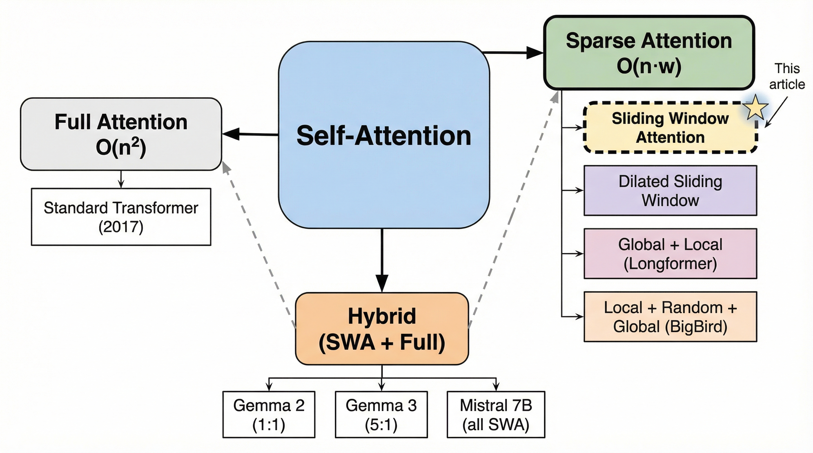

As shown in figure 1, self-attention branches into two main families: full attention with its O(n^2) cost, and sparse attention with its O(n*w) cost. Sliding window attention is the simplest and most widely adopted member of the sparse family. Modern LLMs like Gemma 2, Gemma 3, and Mistral 7B use hybrid approaches that combine SWA with full attention layers.

Let's begin with the problem that motivated sliding window attention in the first place.

---

## The quadratic bottleneck

### Every token talks to every other token

In standard self-attention, every token in a sequence computes an attention score with every other token. For a sequence of n tokens, this produces an n x n attention matrix. The computational cost grows quadratically with sequence length.

Let's make this concrete. For our running example, we use a sequence of 8 tokens: "The", "cat", "sat", "on", "the", "warm", "soft", "mat". The full attention matrix is 8 x 8 = 64 entries. With causal masking (each token can only attend to itself and previous tokens), we get 36 active attention scores.

The quadratic scaling is illustrated in figure 2.

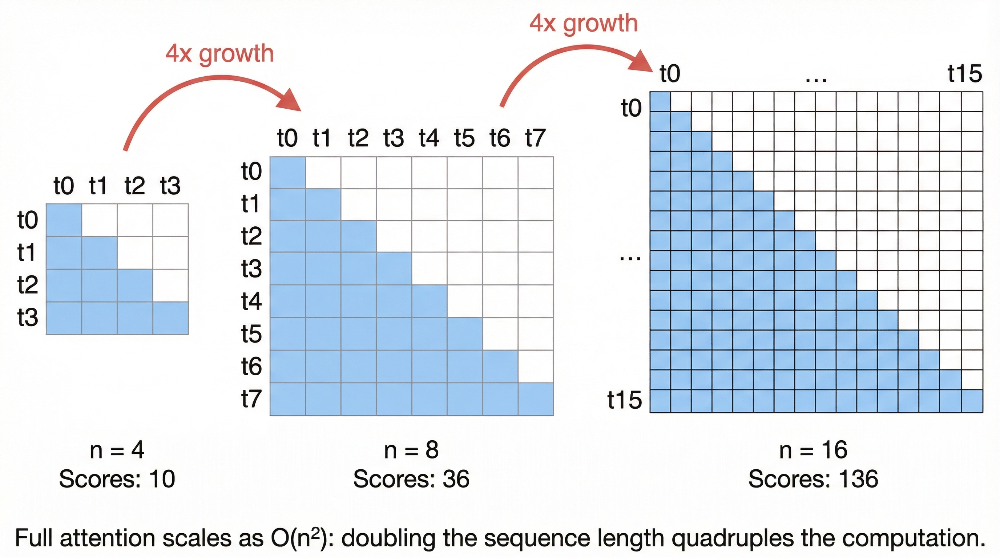

As shown in figure 2, doubling the sequence length quadruples the computation. At n=4, we compute 10 scores. At n=8, that grows to 36. At n=16, it reaches 136. For real-world sequences of 32K or 64K tokens, the numbers become staggering.

The full causal attention matrix for our 8-token example is shown in figure 3.

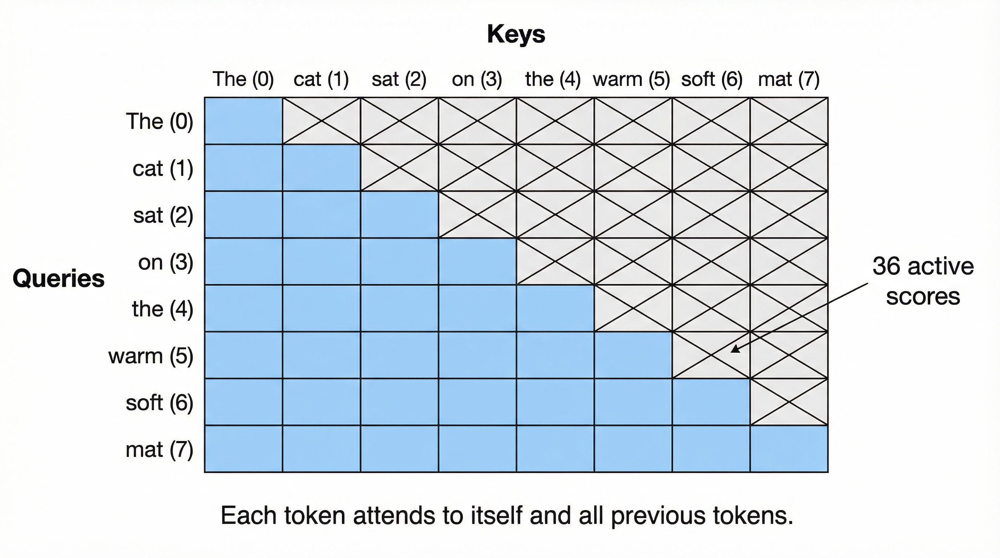

As illustrated in figure 3, token "mat" (position 7) attends to all 8 tokens. Token "on" (position 3) attends to 4 tokens. Token "The" (position 0) attends only to itself. The lower-triangular pattern is the signature of causal attention: no token can peek into the future.

### The memory wall

The quadratic cost creates two separate problems: computation time and memory. The attention matrix itself consumes O(n^2) memory just to store the scores. During autoregressive generation, a second problem emerges: the KV cache.

During generation, each new token needs to attend to all previous tokens. The standard approach stores every past key and value vector in a growing cache. After generating 1,000 tokens, the cache holds 1,000 entries per layer. After 32,000 tokens, it holds 32,000 entries per layer.

For a model like LLaMA 2 7B with 32 layers and 32 attention heads, the KV cache at 32K tokens consumes several gigabytes of GPU memory. This memory cost grows linearly and without bound as generation continues.

What if most of this computation is wasted? What if tokens don't actually need to see the entire sequence?

---

## The core idea of sliding window attention

### Most attention is local

Here is an empirical observation that motivates everything that follows: in trained transformers, attention weights are heavily concentrated on nearby tokens. A token's meaning is most influenced by its immediate neighbors.

Think about natural language. The word "mat" in "The cat sat on the warm soft mat" draws most of its meaning from "warm", "soft", and the preceding context. It has very little need to directly attend to "The" seven positions away. The attention weight assigned to distant tokens is typically very small.

This suggests a powerful simplification: we can restrict attention to a local window of w nearest neighbors without losing much information. This is the core idea of sliding window attention.

The concept is illustrated in figure 4.

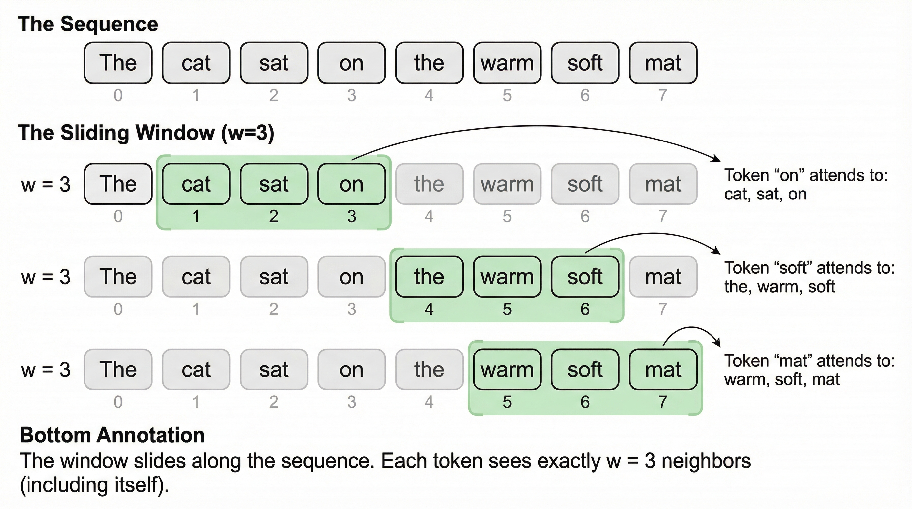

As shown in figure 4, with a window size of w=3, each token attends to exactly 3 positions: itself and its 2 nearest predecessors. Token "on" (position 3) attends to "cat", "sat", and "on". Token "soft" (position 6) attends to "the", "warm", and "soft". The window slides along the sequence, giving each token a limited but consistent local view.

### From full to windowed: the visual transformation

The transformation from full attention to sliding window attention is visually striking. Let's compare them side by side, as shown in figure 5.


As illustrated in figure 5, the full causal attention matrix (left) is a dense lower triangle with 36 active scores. The sliding window matrix (right) retains only a narrow band along the diagonal, reducing the count to 21 active scores. This is a 42% reduction for our small 8-token example. For longer sequences, the savings are far more dramatic.

The banded diagonal pattern is the visual signature of sliding window attention. Every row has at most w colored cells, regardless of how far into the sequence we are.

Now that we have the core intuition, it's time to open the black box. Let's build the sliding window mask step by step.

---

## Building the sliding window mask

The sliding window attention mask is the intersection of two simple constraints. We will construct it piece by piece using our 8-token example with window size w=3.

> **What is an Attention Mask?** An attention mask is a matrix of the same shape as the attention scores that controls which positions each token can attend to. Positions with a mask value of 0 are allowed; positions with negative infinity are blocked. After the softmax operation, blocked positions receive exactly zero attention weight, as if they do not exist.

### Step 1: the causal constraint

The first constraint is the causal mask. This lower-triangular matrix ensures the autoregressive property: no token can peek at future tokens. Token i can attend to token j only if j <= i.

The causal mask for our 8-token sequence is shown in figure 6.

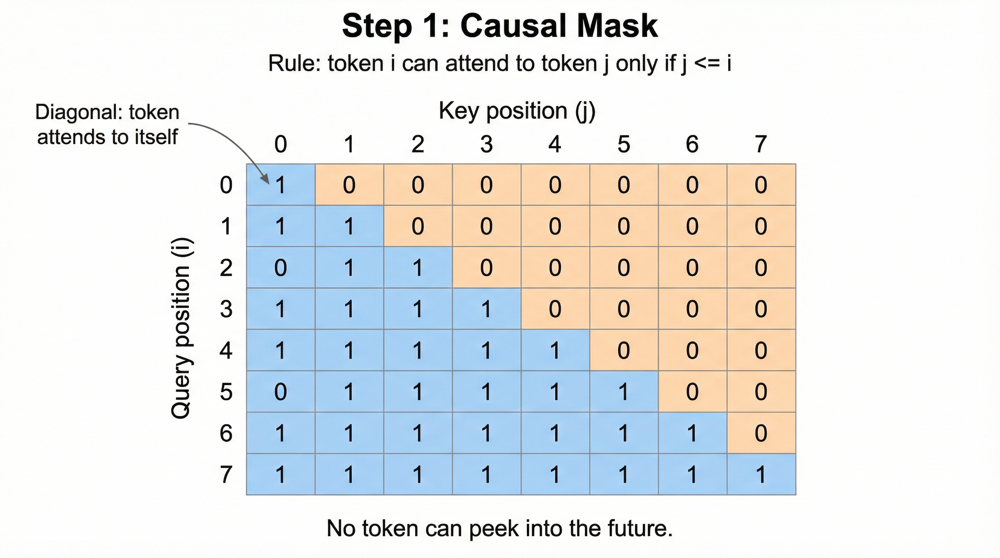

As shown in figure 6, the rule is simple: token i can attend to token j only if j <= i. Token "The" (position 0) attends only to itself. Token "mat" (position 7) attends to all 8 positions. The diagonal divides the matrix into allowed (lower triangle) and blocked (upper triangle) regions.

The causal mask alone gives us full causal attention. This is what we want to improve upon.

### Step 2: the window distance constraint

The second constraint restricts how far back each token can look. For window size w=3, token i can attend to positions where the distance is less than w. Formally, position j is within the window of position i if i - j < w (equivalently, i - j < 3).

The window distance mask is shown in figure 7.

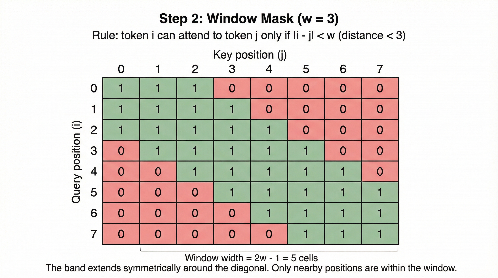

As illustrated in figure 7, the window constraint creates a band of width w centered on the diagonal. Token "mat" (position 7) can attend to positions 5, 6, and 7 (distances 2, 1, and 0), but not to position 4 (distance 3, which equals w). Notice that this band extends both above and below the diagonal, unlike the causal mask.

### Step 3: the intersection

The final sliding window attention mask is simply the intersection of the causal mask and the window mask. A position is attended to only if it satisfies both constraints: it must be at or before the query position (causal), AND it must be within distance w (window).

The combined mask is shown in figure 8.

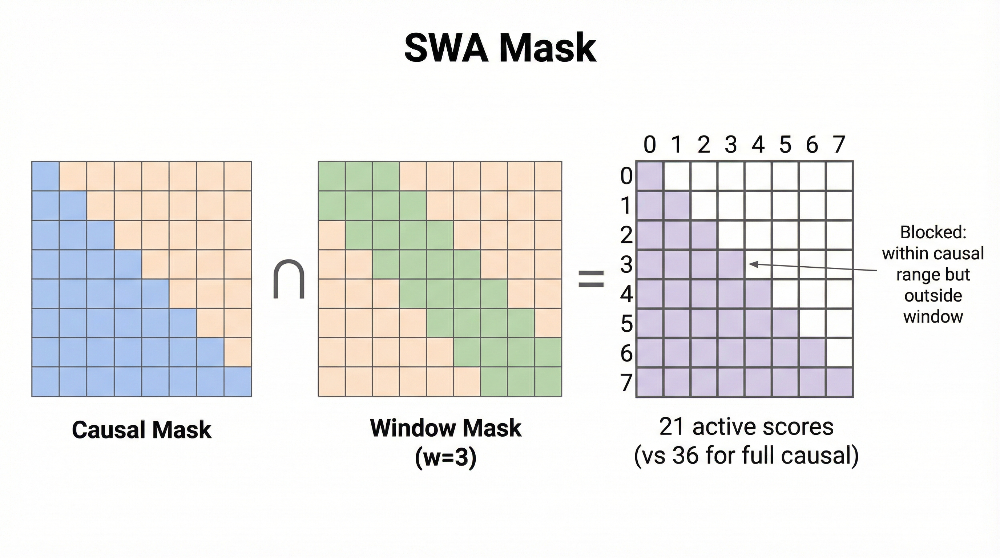

As shown in figure 8, the result is a banded lower-triangular matrix. Let's walk through a few rows:

- **Token "The" (row 0)**: Attends to position 0 only (1 score).
- **Token "cat" (row 1)**: Attends to positions 0 and 1 (2 scores).
- **Token "sat" (row 2)**: Attends to positions 0, 1, and 2 (3 scores, full window).
- **Token "on" (row 3)**: Attends to positions 1, 2, and 3 (3 scores, window kicks in).
- **Token "mat" (row 7)**: Attends to positions 5, 6, and 7 (3 scores).

Starting from row 3, every token attends to exactly w=3 positions. The earlier tokens attend to fewer because they don't have w predecessors available.

### From mask to scores: the negative infinity trick

We have our binary mask. But how does it actually affect the attention computation? The answer is the negative infinity trick.

The process is shown in figure 9.

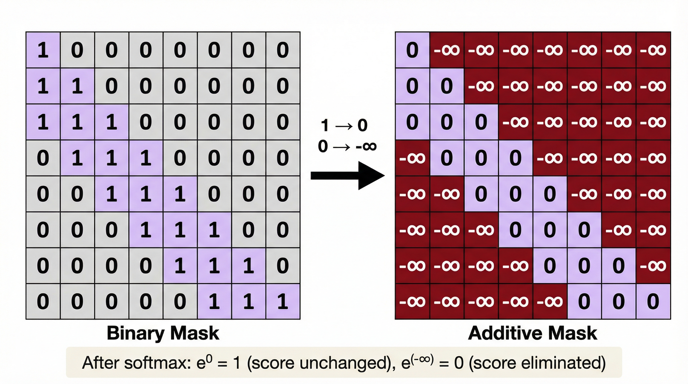

As illustrated in figure 9, we convert the binary mask to an additive mask: allowed positions (1) become 0 (no change), and blocked positions (0) become negative infinity. We then add this mask to the raw Q*K^T scores before applying softmax. Since e^(-infinity) = 0, blocked positions receive exactly zero attention weight after softmax.

This is the standard masked attention pattern. Sliding window attention does not change the attention mechanism itself. It only changes the shape of the mask.

Now let's trace the full attention computation through our running example.

---

## Computing attention scores with a sliding window

### The Q*K^T multiplication

We start with our input matrix of shape (8, 8), representing 8 tokens with 8-dimensional embeddings. After projecting to a single attention head with dimension d_k=4, we have:

- **Q (queries)**: shape (8, 4)
- **K (keys)**: shape (8, 4)
- **V (values)**: shape (8, 4)

The full Q*K^T multiplication produces an (8, 8) matrix of 64 raw attention scores. This is shown in figure 10.

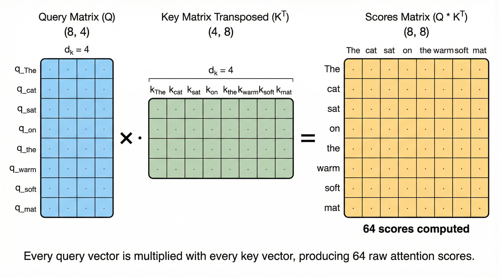

With sliding window attention, most of these 64 scores will be masked to zero. The effective computation involves only the scores within the window band, as shown in figure 11.

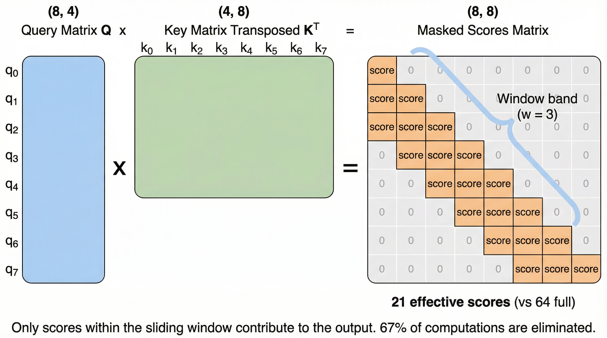

As shown in figure 11, only 24 of the 64 scores matter. In a naive implementation, we still compute all 64 and then mask. In optimized implementations (like FlashAttention with block masking), the masked entries are never computed at all.

### A single token's journey through SWA

Let's zoom in on a single token to see exactly what happens. We will trace token "soft" at position 6 through the complete attention process. With w=3, it attends to positions 4 ("the"), 5 ("warm"), and 6 ("soft").

The full walkthrough is shown in figure 12.


As illustrated in figure 12, the process has four stages:

1. **Query and Keys**: The query vector q_6 (shape 1, 4) multiplies with three key vectors k_4, k_5, k_6 (each shape 1, 4).
2. **Raw Scores**: Three dot products produce three raw scores: q_6 * k_4 = 2.1, q_6 * k_5 = 3.7, q_6 * k_6 = 1.5. These are scaled by 1/sqrt(d_k) = 1/sqrt(4) = 0.5, giving 1.05, 1.85, and 0.75.
3. **Softmax**: Softmax is applied over just these 3 scores, producing weights [0.27, 0.50, 0.23]. Notice that softmax normalizes over 3 values, not 7.
4. **Weighted Sum**: The output is 0.27 * v_4 + 0.50 * v_5 + 0.23 * v_6, producing a single output vector of shape (1, 4).

### Sharper attention through a smaller window

Notice something important about the softmax normalization. In full attention, token "soft" would distribute its attention weight across 7 positions (all tokens at or before position 6). In SWA, the same token concentrates its weight across only 3 positions.

The comparison is shown in figure 13.


As shown in figure 13, the SWA softmax produces sharper, more concentrated attention weights. This can actually be beneficial: the model is forced to focus on the most relevant nearby context rather than spreading thin attention across many positions. The window acts as an inductive bias toward local dependencies.

### The output matrix

Let's see the complete output computation for all tokens, as shown in figure 14.

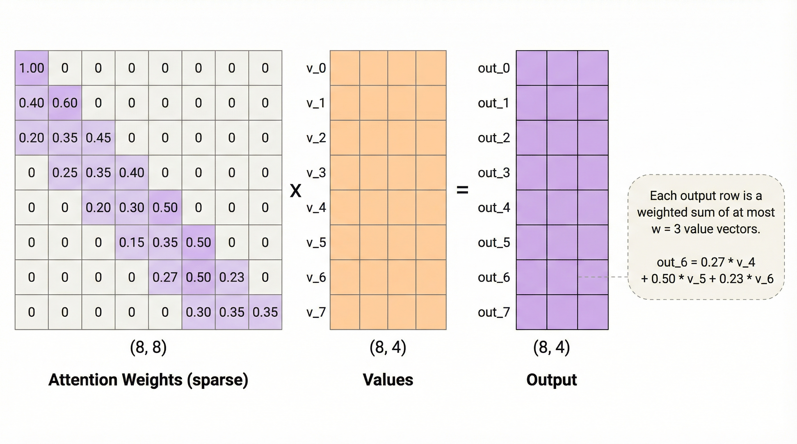

As illustrated in figure 14, the attention weights matrix (8, 8) multiplied by V (8, 4) produces the output matrix (8, 4). Each token's output is a weighted sum of at most w=3 value vectors. The complete shape flow is:

**Q(8,4) * K^T(4,8) -> Scores(8,8) -> Masked + Softmax -> Weights(8,8) * V(8,4) -> Output(8,4)**

We have successfully built a working sliding window attention layer. But a critical question remains: if each layer can only see w=3 tokens, how does the model understand the full sequence?

---

## The layer stacking trick: how local becomes global

### The view from a single layer

At a single layer, the limitation of sliding window attention is clear. Token "mat" (position 7) can only see tokens at positions 5, 6, and 7. It has zero direct access to "The" (position 0), "cat" (position 1), or any token beyond its window.

This is shown in figure 15.

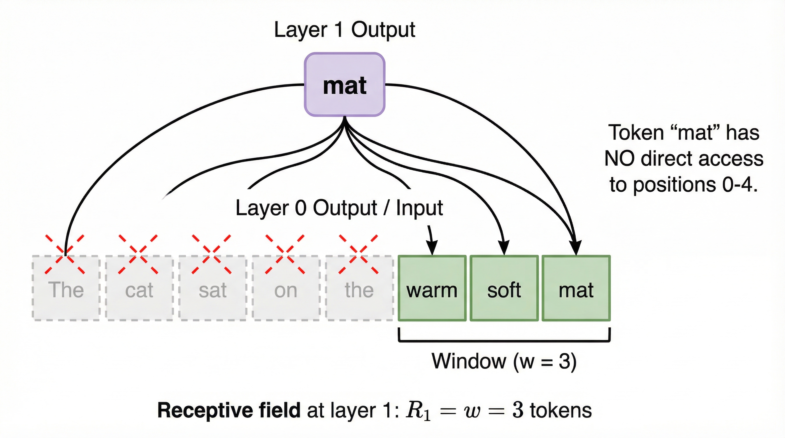

As shown in figure 15, a single layer of SWA gives token "mat" a view of only 3 tokens. This seems like a severe limitation. How can the model understand the full context of a sentence?

But remember, transformers have many layers. Let's see what happens when we stack them.

### Two layers: the receptive field expands

At layer 2, token "mat" still attends to positions 5, 6, and 7, but now these are the representations from layer 1. And those representations themselves incorporated information from their own windows at layer 0.

The expanded view is shown in figure 16.

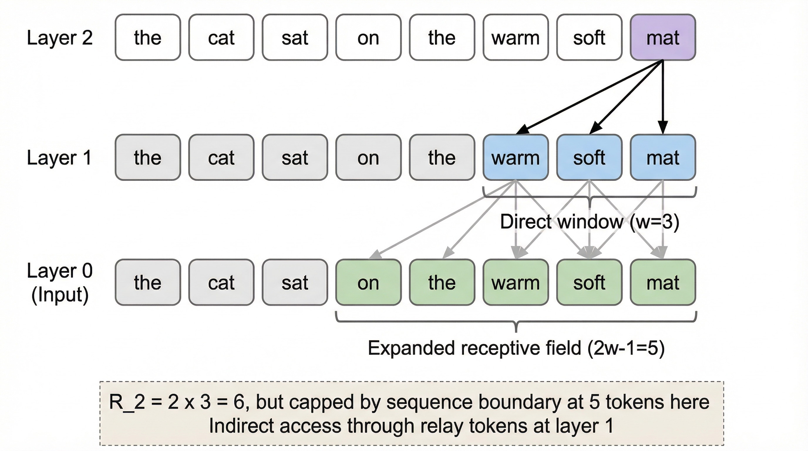

As illustrated in figure 16, position 5 at layer 1 attended to positions 3, 4, and 5 at layer 0. Position 6 at layer 1 attended to positions 4, 5, and 6. Position 7 attended to 5, 6, and 7. The union of all these ranges is positions 3 through 7. The receptive field has grown from 3 tokens to 5 tokens.

This pattern continues with every additional layer.

### Four layers: full coverage for our example

The receptive field grows linearly with depth. The formula is simple and powerful:

**R_L = L * w**

At layer 4 with w=3: R_4 = 4 * 3 = 12 tokens. This exceeds our sequence length of 8. By layer 4, every token has indirect access to the entire sequence, even though each individual layer only looks at 3 neighbors.

The expanding cone of influence across all four layers is shown in figure 17.


As shown in figure 17, the receptive field expands like a cone: 3 tokens at layer 1, 5 at layer 2, 7 at layer 3, and the full sequence by layer 4. This is the magic of stacked sliding window attention. Local operations, repeated across layers, create global information flow.

### The information relay

Let's trace exactly how information from a distant token reaches through this relay. How does "The" (position 0) influence "mat" (position 7)?

The relay path is shown in figure 18.

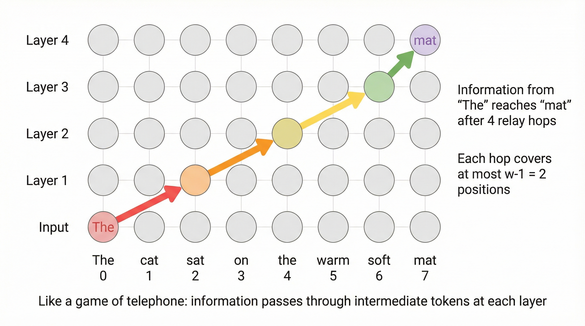

As illustrated in figure 18, the information travels through a chain of intermediate tokens, like a game of telephone:

1. **Input to Layer 1**: "The" (position 0) contributes to "sat" (position 2) via attention.
2. **Layer 1 to Layer 2**: "sat" contributes to "the" (position 4).
3. **Layer 2 to Layer 3**: "the" contributes to "soft" (position 6).
4. **Layer 3 to Layer 4**: "soft" contributes to "mat" (position 7).

Each hop covers at most w-1 = 2 positions. After 4 hops across 4 layers, information has traveled 7 positions, spanning the entire sequence.

> **Theoretical vs Effective Receptive Field**: The formula R_L = L * w gives the theoretical maximum receptive field, assuming each layer perfectly transmits all information from its entire window. In practice, the effective receptive field is smaller because attention weights are not uniform. Information degrades with each relay step, similar to the game of telephone. This is a key trade-off of SWA compared to full attention, where every token has a direct, one-hop path to every other token.

### Scaling to real models

For production-scale models, the receptive field numbers are impressive. The growth is shown in figure 19.

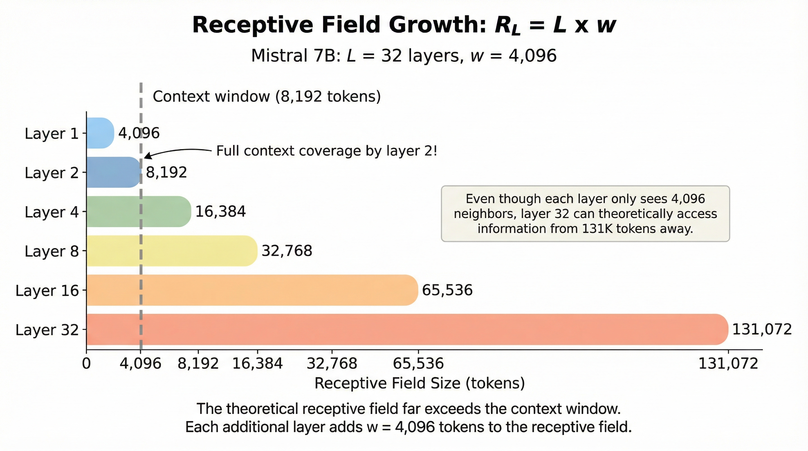

As shown in figure 19, Mistral 7B has 32 layers with w=4,096. The theoretical receptive field at the final layer is:

**R_32 = 32 * 4,096 = 131,072 tokens**

This far exceeds Mistral's 8,192-token context window. In principle, information from the very first token can reach the very last token through the relay mechanism. In practice, the quality of information degrades with each relay step, but the architectural capacity is there.

Now that we understand how SWA works during the forward pass, let's see how it transforms inference efficiency with the rolling buffer KV cache.

---

## The rolling buffer KV cache

### The problem with standard KV caches

During autoregressive generation, each new token needs to attend to all previous tokens. The standard approach stores every past key and value vector in a cache that grows with each generated token.

The growing cache is shown in figure 20.

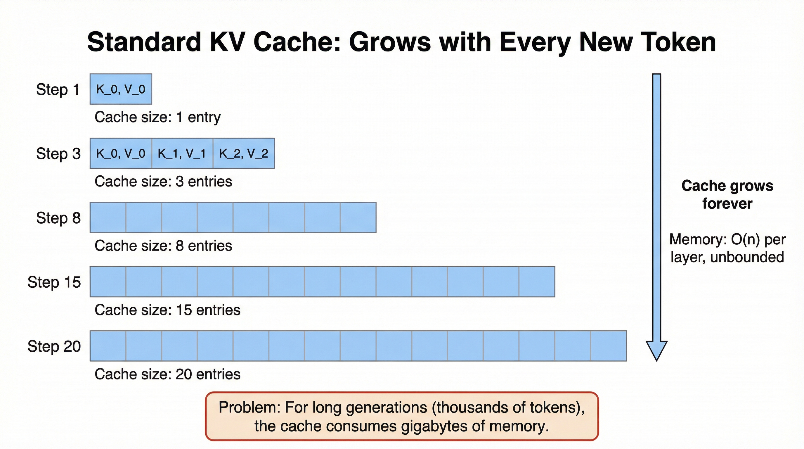

As shown in figure 20, the cache starts with 1 entry at step 1 and grows to 20 entries by step 20. For long generations of thousands of tokens, the cache consumes gigabytes of memory. The memory cost is O(n) per layer, and it grows without bound.

Sliding window attention changes this equation entirely.

### The circular buffer design

With SWA, a token at position t only attends to positions [t-w+1, t]. Tokens at positions earlier than t-w+1 will never be attended to again. This means their KV entries can be safely overwritten.

The rolling buffer concept is shown in figure 21.

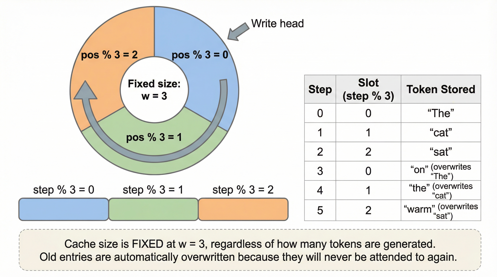

As illustrated in figure 21, the rolling buffer is a fixed-size circular buffer of size w. The key insight is modular indexing: each new token writes to position `step % w` in the buffer. When the buffer is full, new entries overwrite the oldest ones. The cache size is fixed at w entries per layer, regardless of how many tokens are generated.

The mapping table shows our running example:

- **Step 0**: Slot 0, stores "The"
- **Step 1**: Slot 1, stores "cat"
- **Step 2**: Slot 2, stores "sat"
- **Step 3**: Slot 0, stores "on" (overwrites "The")
- **Step 4**: Slot 1, stores "the" (overwrites "cat")
- **Step 5**: Slot 2, stores "warm" (overwrites "sat")

The old entries are automatically discarded because they will never be attended to again. This is the beauty of sliding window attention applied to inference.

### Step-by-step buffer walkthrough

Let's walk through the rolling buffer for 8 generation steps with w=3, as shown in figure 22.


As shown in figure 22, the pattern is clear. Steps 0 through 2 fill the three buffer slots. Starting at step 3, the buffer begins cycling: step 3 writes to slot 0 (3 % 3 = 0), step 4 writes to slot 1, step 5 writes to slot 2, and so on. At every point, the buffer contains exactly the 3 most recent tokens.

### Memory savings quantified

The memory savings grow with sequence length. For a fixed window size w, the longer the sequence, the more dramatic the savings.

The comparison is shown in figure 23.

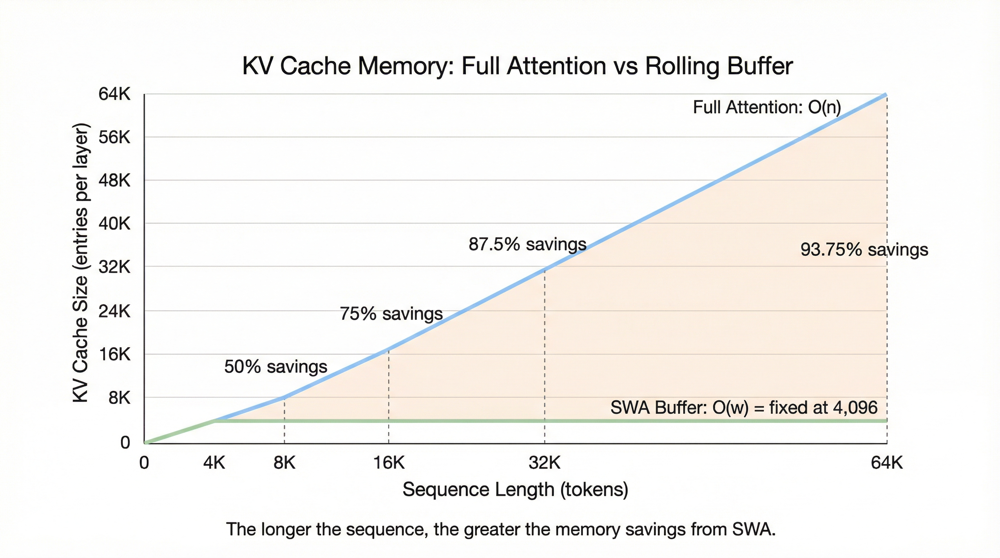

As illustrated in figure 23, the full attention cache grows linearly with sequence length while the SWA rolling buffer remains constant. The savings formula is:

**Savings = 1 - (w / n)**

- **At n=8K, w=4096**: 8,192 entries (full) vs 4,096 entries (SWA) = **50% saved**
- **At n=16K**: 16,384 vs 4,096 = **75% saved**
- **At n=32K**: 32,768 vs 4,096 = **87.5% saved**
- **At n=64K**: 65,536 vs 4,096 = **93.75% saved**

For Mistral 7B (32 layers, 8 KV heads, 128-dim heads, fp16), the SWA rolling buffer requires a fixed 512 MB regardless of sequence length. A full attention model at 32K tokens would need over 4 GB.

### Combining with grouped query attention

Mistral 7B combines SWA with another technique for even greater savings: grouped query attention (GQA). The combined effect is shown in figure 24.


As shown in figure 24, the two techniques multiply:

- **GQA**: 32 query heads share 8 KV heads (4:1 ratio), reducing the cache by 4x.
- **SWA**: The rolling buffer caps cache at w=4,096 entries instead of the full 8,192 context, reducing by another 2x.
- **Combined**: 4x * 2x = **8x total reduction**.

This is how Mistral 7B achieves LLaMA 2 13B-level performance with 44% fewer parameters and 8x less KV cache memory. The combination of GQA and SWA makes long-context inference practical on consumer hardware.

There is one more inference optimization that SWA enables: pre-fill chunking.

---

## Pre-fill chunking

### The pre-fill memory spike

When a user sends a long prompt, the model must process it all at once before it can begin generating. This is the "pre-fill" phase. The standard approach processes the entire prompt in a single forward pass, which requires materializing the full n x n attention matrix.

The problem is shown in figure 25.


As illustrated in figure 25, processing an 8K-token prompt in one pass requires an (8K, 8K) attention matrix, consuming approximately 4,160 MB of peak memory. This is the same quadratic bottleneck, but now as a memory spike during inference.

### Chunking the prompt

SWA provides a natural solution. Since each token only needs to attend to its w nearest neighbors, we can split the prompt into chunks of size w and process each chunk sequentially.

The chunked approach is shown in figure 26.

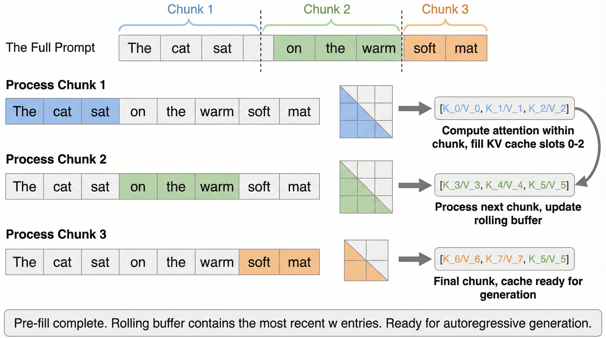

As shown in figure 26, our 8-token prompt is split into three chunks. Each chunk computes attention only within its local window, then updates the rolling buffer. The next chunk picks up where the previous one left off.

For an 8K-token prompt with w=4,096, this means two chunks instead of one massive pass. The peak memory drops from O(n^2) to O(w^2), a reduction of approximately 74.6%.

We have now covered the complete sliding window attention mechanism. Let's zoom out and see how it fits into the broader family of efficient attention.

---

## The family of sparse attention

### The taxonomy of sparse attention

Sliding window attention is the simplest member of a family of sparse attention mechanisms. Each variant adds different strategies for maintaining information flow while keeping computation sub-quadratic.

The full taxonomy is shown in figure 27.


As illustrated in figure 27, the spectrum runs from full attention (densest, most expensive) to increasingly sparse patterns. Each pattern trades some expressiveness for lower compute cost:

- **Full Attention**: O(n^2), every token attends to all previous tokens.
- **Sliding Window**: O(n * w), local neighbors only.
- **Dilated Window**: O(n * w), wider reach at the same cost.
- **Sliding + Global**: O(n * w + n * g), local plus hub tokens.
- **BigBird**: O(n * (w + r + g)), local + global + random.

Let's examine each variant in more detail.

### Longformer's dilated sliding window

The standard sliding window attends to w consecutive neighbors. Longformer introduces a variation: instead of consecutive positions, skip every d positions. This is the dilated sliding window.

The comparison is shown in figure 28.


As shown in figure 28, with standard SWA (w=3), each token attends to 3 consecutive neighbors, covering a range of 3 positions. With dilated SWA (w=3, d=2), each token still attends to 3 positions, but they are spread across a range of 6 positions.

The per-layer receptive field becomes d * w instead of w, and the total receptive field across L layers becomes L * d * w. This wider reach comes at zero additional compute cost, since the number of attended positions remains the same.

In Longformer, the lower layers use standard SWA (capturing fine-grained local context), while the upper layers use dilated SWA (capturing broader context).

### Global attention tokens

Longformer adds one more component: global attention. Certain pre-selected tokens (such as the [CLS] token in classification tasks) receive full attention to the entire sequence, and all positions attend to them.

The global attention mechanism is shown in figure 29.

![Figure 29 Longformer's global attention mechanism. Pre-selected tokens (such as [CLS]) attend to all positions in the sequence, and all positions attend to them. These global tokens act as information hubs, enabling long-range communication alongside local sliding window attention.](../figures/output/fig_global_attention.png)

As illustrated in figure 29, global tokens act as information hubs. They break the locality constraint of SWA by providing every token a direct connection to at least one position that has seen the entire sequence. The cost is O(g * n) where g is the number of global tokens, which is small compared to the O(n^2) of full attention.

Longformer uses separate projection matrices for global attention: (Q_g, K_g, V_g) in addition to the standard (Q_s, K_s, V_s) for sliding window attention.

### BigBird: adding randomness

BigBird takes a different approach to long-range connections. It combines three types of attention: local window, global tokens, and random connections.

The three components are shown in figure 30.


As shown in figure 30, the three components work together:

- **Local Window (blue)**: Captures nearby context, just like standard SWA. Complexity: O(n * w).
- **Global Tokens (pink)**: Designated hub tokens that attend to all positions and receive attention from all positions. Complexity: O(n * g).
- **Random Connections (orange)**: Each token randomly attends to r additional tokens anywhere in the sequence. Complexity: O(n * r).

The random connections are the key theoretical innovation. Graph theory tells us that random edges create shortcut paths, ensuring information can propagate between any two tokens in O(log n) hops. This makes BigBird a universal approximator of full attention while maintaining linear overall complexity.

Modern LLMs have taken a simpler approach: hybrid architectures that alternate between SWA and full attention.

---

## Hybrid architectures in modern LLMs

### The hybrid design

Instead of complex sparse patterns like BigBird's three-component attention, modern LLMs use a simpler strategy: alternate between sliding window layers and full attention layers. The full attention layers act as periodic "global checkpoints" that allow long-range information to flow freely.

The hybrid layer stack is shown in figure 31.


As illustrated in figure 31, Gemma 3 uses a 5:1 ratio: five consecutive SWA layers (with w=1,024) followed by one full attention layer. The SWA layers handle local attention with a small KV cache (only w entries). The full attention layers act as periodic global checkpoints, attaching to all positions in the sequence.

This design achieves less than 0.3% perplexity loss compared to using full attention everywhere, while reducing the average KV cache by approximately 5x.

### The evolving landscape

The optimal hybrid strategy is still being explored. The evolution of approaches across model generations is shown in figure 32.


As shown in figure 32, the landscape has shifted rapidly:

- **Mistral 7B (2023)**: All SWA layers, w=4,096. The model that popularized SWA in production LLMs. Ratio: 6:0 (all SWA, no full attention).
- **Gemma 2 (2024)**: Alternating SWA and full attention layers, 1:1 ratio, w=4,096.
- **Gemma 3 (2025)**: More aggressive 5:1 ratio with a smaller window of w=1,024.
- **Mistral Small 3.1 (2025)**: Dropped SWA entirely, returning to full attention with FlashAttention optimizations.

The fact that Mistral Small 3.1 dropped SWA is significant. It suggests that for some model sizes and use cases, hardware-optimized full attention (FlashAttention) may be efficient enough to make the complexity of SWA unnecessary. No single approach dominates; the field continues to experiment.

Having explored the theory and its variants, let's quantify the concrete gains.

---

## Quantifying the gains

### Compute savings

The fundamental advantage of SWA is reducing attention computation from O(n^2) to O(n * w). The savings grow with sequence length.

The scaling comparison is shown in figure 33.

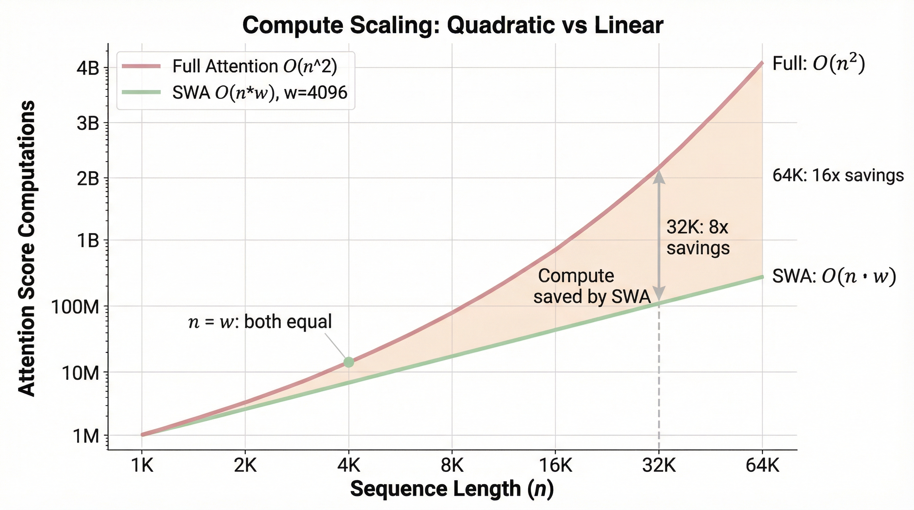

As illustrated in figure 33, the two curves diverge dramatically as sequence length increases. At n=4K (where n equals w), both methods compute the same number of scores. Beyond that point, the gap widens:

- **At n=8K**: Full attention computes 64M scores vs SWA's 32M = **2x savings**
- **At n=16K**: 256M vs 64M = **4x savings**
- **At n=32K**: 1,024M vs 128M = **8x savings**
- **At n=64K**: 4,096M vs 256M = **16x savings**

The shaded region between the curves represents the compute saved by SWA. The longer the sequence, the greater the benefit.

### Memory savings

Memory savings are equally dramatic. The KV cache savings at different sequence lengths are shown in figure 34.

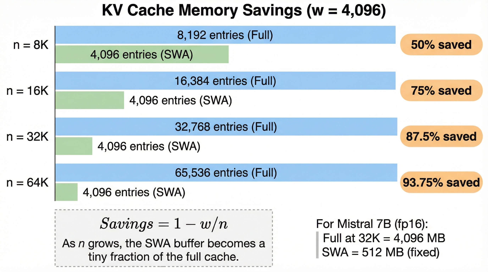

As shown in figure 34, the visual contrast between the full and SWA bars becomes increasingly dramatic as sequence length grows. The SWA bar (green) remains fixed at 4,096 entries regardless of sequence length, while the full bar (blue) grows linearly.

For Mistral 7B specifically, the fixed SWA cache is 512 MB (fp16). Combined with GQA's 4x reduction, the total KV cache for Mistral 7B is 8x smaller than an equivalent model using full multi-head attention. These savings make long-context inference practical on consumer hardware with limited GPU memory.

Having explored the theory, let's put our knowledge to the test with code.

---

## Implementation in PyTorch

### Building the mask

The SWA mask can be implemented in just a few lines. Let's start with a naive version that makes the logic clear, then optimize.

**Naive implementation (double loop):**

```python
import torch

def create_swa_mask_naive(seq_len, window_size):
    """Create a causal sliding window attention mask (naive)."""
    mask = torch.zeros(seq_len, seq_len)
    for i in range(seq_len):
        for j in range(seq_len):
            if j <= i and i - j < window_size:
                mask[i, j] = 1.0
    # Convert: 1 -> 0.0 (allowed), 0 -> -inf (blocked)
    attn_mask = mask.masked_fill(mask == 0, float('-inf'))
    attn_mask = attn_mask.masked_fill(mask == 1, 0.0)
    return attn_mask
```

The two conditions are explicit: `j <= i` enforces causality, and `i - j < window_size` enforces the window. Together, they produce the banded lower-triangular matrix we constructed earlier.

**Efficient vectorized version:**

```python
def create_swa_mask(seq_len, window_size):
    """Efficient sliding window causal mask using broadcasting."""
    row = torch.arange(seq_len).unsqueeze(1)  # (seq_len, 1)
    col = torch.arange(seq_len).unsqueeze(0)  # (1, seq_len)
    # Two conditions, one line
    mask = (col <= row) & (row - col < window_size)
    return mask.float().masked_fill(~mask, float('-inf')).masked_fill(mask, 0.0)
```

The vectorized version replaces the double loop with broadcasting. The result is identical but runs orders of magnitude faster.

The mask produced by this code is visualized in figure 35.


As shown in figure 35, the two simple conditions `(col <= row)` and `(row - col < w)` create the entire mask. The lavender band along the diagonal contains zeros (allowed), while the salmon region contains negative infinity (blocked).

### The complete SWA forward pass

With the mask in hand, the forward pass is nearly identical to standard attention. Sliding window attention changes exactly one thing: the mask shape.

```python
import torch
import torch.nn as nn
import torch.nn.functional as F
import math

class SlidingWindowAttention(nn.Module):
    def __init__(self, d_model, num_heads, window_size):
        super().__init__()
        self.d_model = d_model
        self.num_heads = num_heads
        self.d_k = d_model // num_heads
        self.window_size = window_size

        self.W_q = nn.Linear(d_model, d_model)
        self.W_k = nn.Linear(d_model, d_model)
        self.W_v = nn.Linear(d_model, d_model)
        self.W_o = nn.Linear(d_model, d_model)

    def forward(self, x):
        batch, seq_len, _ = x.shape

        # Standard Q, K, V projections (unchanged from normal attention)
        Q = self.W_q(x).view(batch, seq_len, self.num_heads, self.d_k).transpose(1, 2)
        K = self.W_k(x).view(batch, seq_len, self.num_heads, self.d_k).transpose(1, 2)
        V = self.W_v(x).view(batch, seq_len, self.num_heads, self.d_k).transpose(1, 2)

        # Compute Q * K^T / sqrt(d_k)
        scores = torch.matmul(Q, K.transpose(-2, -1)) / math.sqrt(self.d_k)

        # THE ONLY DIFFERENCE: apply the SWA mask instead of a causal mask
        mask = create_swa_mask(seq_len, self.window_size).to(x.device)
        scores = scores + mask

        # Standard softmax and weighted sum
        weights = F.softmax(scores, dim=-1)
        output = torch.matmul(weights, V)

        # Reshape and project
        output = output.transpose(1, 2).contiguous().view(batch, seq_len, self.d_model)
        return self.W_o(output)
```

The entire change from full attention to sliding window attention is a single line: replacing the causal mask with the SWA mask. Everything else, the projections, the scaling, the softmax, the weighted sum, remains identical.

### The rolling buffer cache

For autoregressive generation, we implement the rolling buffer as a fixed-size circular buffer with modular indexing.

```python
class RollingKVCache:
    def __init__(self, window_size, num_layers, num_kv_heads, head_dim, dtype=torch.float16):
        self.window_size = window_size
        self.k_cache = torch.zeros(num_layers, window_size, num_kv_heads, head_dim, dtype=dtype)
        self.v_cache = torch.zeros(num_layers, window_size, num_kv_heads, head_dim, dtype=dtype)
        self.position = 0

    def update(self, layer_idx, new_k, new_v):
        """Write new KV pair at the circular buffer position."""
        idx = self.position % self.window_size
        self.k_cache[layer_idx, idx] = new_k
        self.v_cache[layer_idx, idx] = new_v

    def advance(self):
        """Move the write head forward after processing a token."""
        self.position += 1

    def get_keys(self, layer_idx):
        """Return all valid keys in cache for this layer."""
        if self.position < self.window_size:
            return self.k_cache[layer_idx, :self.position + 1]
        return self.k_cache[layer_idx]  # full buffer, all entries valid

    def get_values(self, layer_idx):
        """Return all valid values in cache for this layer."""
        if self.position < self.window_size:
            return self.v_cache[layer_idx, :self.position + 1]
        return self.v_cache[layer_idx]
```

The `update` method uses modular indexing (`position % window_size`) to determine where to write. The `get_keys` and `get_values` methods return all valid entries. Once the buffer is full, all w entries are always valid.

### Modern approach: FlexAttention

PyTorch 2.5+ introduces FlexAttention, a high-level API that compiles custom attention patterns into fused CUDA kernels. The sliding window mask that took us several functions to implement above can be expressed in 3 lines.

```python
from torch.nn.attention.flex_attention import flex_attention, create_block_mask

WINDOW_SIZE = 4096

def sliding_window(b, h, q_idx, kv_idx):
    """Mask function for sliding window attention."""
    causal = q_idx >= kv_idx
    window = q_idx - kv_idx < WINDOW_SIZE
    return causal & window

# Create the block mask (compiled, no materialization)
block_mask = create_block_mask(sliding_window, B=1, H=1, Q_LEN=seq_len, KV_LEN=seq_len)

# Run attention with fused kernel
output = flex_attention(query, key, value, block_mask=block_mask)
```

FlexAttention handles the optimization automatically: it never materializes the full mask matrix, uses block-sparse computation to skip entirely empty blocks, and fuses the masking into the attention kernel. The result is both cleaner code and faster execution.

---

## Summary

We have built sliding window attention from the ground up, starting with the problem it solves and ending with a working implementation. Here are the key takeaways.

- **The quadratic bottleneck**: Standard self-attention computes an n x n attention matrix, making it prohibitively expensive for long sequences. At 32K tokens, full attention requires over 1 billion score computations. Sliding window attention restricts each token to its w nearest neighbors, reducing complexity from O(n^2) to O(n * w).

- **The sliding window mask**: The SWA mask is the intersection of two simple constraints: the causal mask (no future tokens) and the window distance mask (attend only within distance w). The result is a banded lower-triangular matrix that can be implemented in a single line of vectorized PyTorch code.

- **The layer stacking trick**: Despite the limited per-layer window, stacking L layers creates a theoretical receptive field of L * w tokens. For Mistral 7B with 32 layers and w=4,096, this reaches 131,072 tokens, far exceeding its 8,192-token context window. Information from distant tokens reaches through a relay of intermediate tokens across layers.

- **The rolling buffer KV cache**: During autoregressive generation, SWA enables a fixed-size circular buffer that caps memory at w entries per layer, regardless of sequence length. The savings grow with context: 50% at 8K tokens, 87.5% at 32K, and 93.75% at 64K. Combined with grouped query attention, Mistral 7B achieves an 8x total KV cache reduction.

- **The broader landscape**: SWA is the simplest member of a family of sparse attention mechanisms. Longformer adds dilated windows (for wider reach at the same cost) and global attention tokens (as information hubs). BigBird adds random connections for theoretical completeness. Modern LLMs like Gemma use hybrid approaches that alternate SWA and full attention layers.

- **A still-evolving field**: The optimal attention strategy depends on model size, context length, and hardware. Gemma 3 pushes toward aggressive 5:1 SWA-to-full ratios. Mistral Small 3.1 dropped SWA entirely in favor of optimized full attention. The pendulum continues to swing, and the right answer depends on your specific constraints.

---

## Further Reading

- **Longformer: The Long-Document Transformer** (Beltagy, Peters, Cohan, 2020) - The paper that introduced sliding window attention for transformers, combined with dilated windows and global attention. [arxiv.org/abs/2004.05150](https://arxiv.org/abs/2004.05150)

- **Mistral 7B** (Jiang et al., 2023) - The model that brought SWA to production decoder-only LLMs, introducing the rolling buffer KV cache and pre-fill chunking. [arxiv.org/abs/2310.06825](https://arxiv.org/abs/2310.06825)

- **BigBird: Transformers for Longer Sequences** (Zaheer et al., 2020) - Proved that sparse attention with local + global + random connections is a universal approximator. [NeurIPS 2020](https://papers.neurips.cc/paper_files/paper/2020/file/c8512d142a2d849725f31a9a7a361ab9-Paper.pdf)

- **Gemma 3 Technical Report** (Google, 2025) - Describes the 5:1 hybrid SWA-to-full attention ratio with less than 0.3% perplexity loss.

- **The Big LLM Architecture Comparison** (Sebastian Raschka) - Comprehensive comparison of attention strategies across modern LLMs. [magazine.sebastianraschka.com](https://magazine.sebastianraschka.com/p/the-big-llm-architecture-comparison)

---

*If you found this helpful, consider subscribing for more deep dives into the architectures behind modern AI.*
